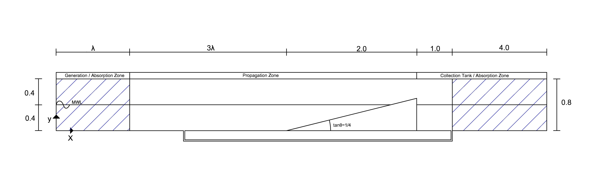

Overtopping over constant slope dike using the NewWave Theory 
==============================================================

Description
-----------
This application has been set up to calibrate and evaluate the ability of proteus to calculate overtopping over a constant slope, impermeable dike.

The NewWave Theory originally presented in Tromans et al. (1991) may be used instead of simulating the free surface elevation timeseries of a typical storm. A typical application is the ability to calculate the maximum individual overtopping volume avoiding the time consuming simulation of 500 waves, which is needed in order to capture an extreme ovetopping event. According to this theory, a group of 3-4 waves is simulated, in a form of a focused wave group, reproducing an extreme overtopping event.

The boundary areas [x+] and [y-] are defined as free slip walls, the upper boundary [y+] is left open and the [x-] is the velocity inlet.

The areas of the geometry are the generation and absorption zones, the wave propagation zone before the obstacle, 
the collection tank and a drainage pipe to ensure that the MWL in the landward tank is not decreasing due to the volume of water that overtops. 

The obstacle can be described as a constant-slope, positive freeboard impermeable dike with crest height Rc=0.1m and slope tanθ=1/4. 
The leeward side of the obstacle is designed as a vertical wall, with zero crest width (sharp-crested structure). 
This case study corresponds to the geometry of one of the tests encountered in the CLASH database (EuroTop 2018) so there are experimental data available for comparison. 




Context Options
---------------
+---------------------+-------------------------------------------------------------------------+-------------------+
| Tank Options        | Description                                                             | Default value (m) |
+=====================+=========================================================================+===================+
| tank_height         | Positive Y-Coordinate of the tank                                       | 0.8               |
+---------------------+-------------------------------------------------------------------------+-------------------+
| L_back              | Horizontal Dimension of the collection tank after the drainage outlet   | 0.8               |
+---------------------+-------------------------------------------------------------------------+-------------------+
| tank_depth          | Negative Y-Coordinate of the tank / Lower level of drainage pipe        | 0.5               |
+---------------------+-------------------------------------------------------------------------+-------------------+
| obs_depth           | Negative Y-Coordinate of the tank / Upper level of drainage pipe        | 0.4               |
+---------------------+-------------------------------------------------------------------------+-------------------+
| tube                | Drainge pipe diameter                                                   | 0.1               |
+---------------------+-------------------------------------------------------------------------+-------------------+
| deposit width       | Width of the ovetopping collection tank                                 | 4.0               |
+---------------------+-------------------------------------------------------------------------+-------------------+
| structure_slope     | Slope of the dike, defubed as 1/structure_slope                         | 4                 |          
+---------------------+-------------------------------------------------------------------------+-------------------+
| structureCrestLevel | Y-Coordinate at the crest of the positive freeboard dike (MWL+Rc)       |0.5                |
+---------------------+-------------------------------------------------------------------------+-------------------+

+---------------------+-------------------------------------------------------------------------+-------------------+
| Wave Options        | Description                                                             | Default value     |
+=====================+=========================================================================+===================+
| Hs                  | Significant Wave height                                                 | 0.1675            |
+---------------------+-------------------------------------------------------------------------+-------------------+
| Tp                  | Peak Wave Period                                                        | 2.326             |
+---------------------+-------------------------------------------------------------------------+-------------------+
| Nmax                |Normalisation factor to get the 1/N wave event at the NewWave series     | 1000              |
+---------------------+-------------------------------------------------------------------------+-------------------+
| tfocus              |Time of focused crest / trough                                           | 10                |
+---------------------+-------------------------------------------------------------------------+-------------------+
| crestFocus          |Switch to determine if crest focused or trough focused.                  | True              |
+---------------------+-------------------------------------------------------------------------+-------------------+
| xfocus              |Position of focused crest / trough                                       |([0.,0.,0.])       |
+---------------------+-------------------------------------------------------------------------+-------------------+

  


Test case
-----

To run the test case type:

```
parun --TwoPhaseFlow -f new_wave.py -v -D result_folder
```

Wave properties can be modified by the commandline, using for example:

```
parun --TwoPhaseFlow -f new_wave.py -v -D result_folder -C "mwl=0.4"
```

To run in parallel (example with mpirun and 12 processors):

```
mpirun -np 12 parun --TwoPhaseFlow -f new_wave.py -v -D result_folder -C "mwl=0.4"
```


To see guidance on parun options, you can type  

```
parun -h
```


References
----------
P.S. Tromans, A.R. Anaturk and P. Hagemeijer 1991, A new model for the kinematics of large ocean waves - Applications as a design wave

Hunt-Raby AC, Borthwick AGL, Stansby PK & Taylor PH 2011 'Experimental measurement of focused wave group and solitary wave overtopping' JOURNAL OF HYDRAULIC RESEARCH 49, (4) 450-464 Author Site , DOI

EurOtop, 2018.  Manual on wave overtopping of sea defences and related structures.  An overtopping manual largely based on European research, but for worldwide application.  Van der Meer, J.W., Allsop, N.W.H., Bruce, T., De Rouck, J., Kortenhaus, A., Pullen, T., Schüttrumpf, H., Troch, P. and Zanuttigh, B., www.overtopping-manual.com

